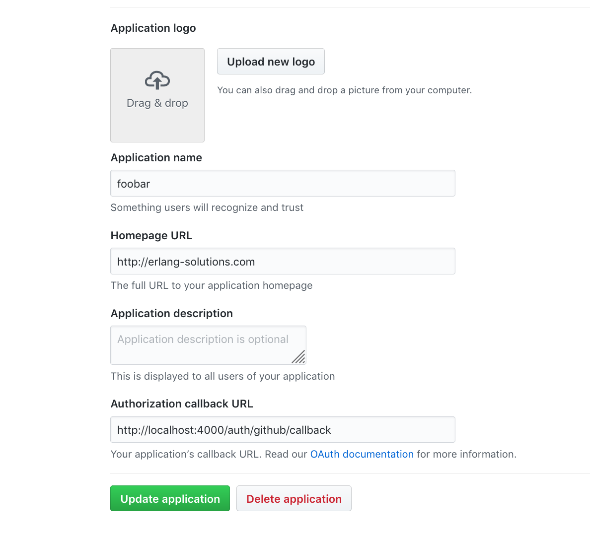

# ReleaseAdmin


## Running the application 

(Optional) - you might want to read the Github guides to [creating an oauth application](https://developer.github.com/apps/building-oauth-apps/creating-an-oauth-app/), and [authorizing oauth applications](https://developer.github.com/apps/building-oauth-apps/authorizing-oauth-apps/).

To summarise - you will need to create a new OAuth application on Github and provide it's `CLIENT_ID` and `CLIENT_SECRET` values to the release_admin application via environment variables.

The steps involved are as follows - 

1. Create a new github application via the following [url](https://github.com/settings/applications/new)

2. For testing purposes we've chosen the values displayed in this image : 



Having created the application, you will be given the opportunity to copy the GITHUB_CLIENT_ID, and GITHUB_CLIENT_SECRET - Github offers the option to regenerate the secret later if need be. In any event, copy them somewhere *secure*.

3. Set the appropriate environmnental variables in the environment where you will be running the 'release_admin' application: 

```
export RELEASE_ADMIN_GITHUB_CLIENT_ID=<GITHUB_CLIENT_ID>
export RELEASE_ADMIN_GITHUB_CLIENT_SECRET=<GITHUB_CLIENT_SECRET>
```

4. Start the Phoenix web server :  

  * Install dependencies with `mix deps.get`
  * Create and migrate your database with `mix ecto.create && mix ecto.migrate`
  * Install Node.js dependencies with `cd assets && npm install`
  * Start Phoenix endpoint with `mix phx.server`

5. Navigate to the [authorization screen](http://localhost:4000/auth/github) and follow the authorization process. 

This application will ask for the [following](https://github.com/sescobb27/release_admin/blob/a881d7412e934b12533fe3a05349d81f30bfe1df/config/config.exs#L27) (read only) privileges : 

1. read:user 
2. user:email, 
3. read:org
4. repo:status
